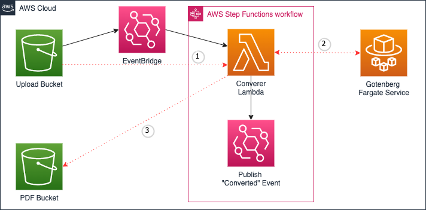

# Serverless Demo Application
Convert uploaded office documents to PDF using project Gotenberg. Serverless app based on StepFunctions, S3, EventBridge, Fargate, and Lambda.

## Links

https://gotenberg.dev/  
https://github.com/shelfio/aws-lambda-libreoffice  
https://www.linkedin.com/pulse/how-build-automatic-grading-solution-handwriting-aws-wong/  
